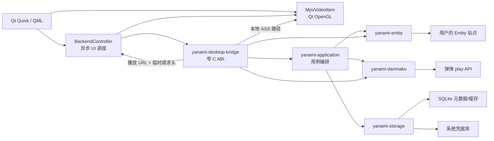
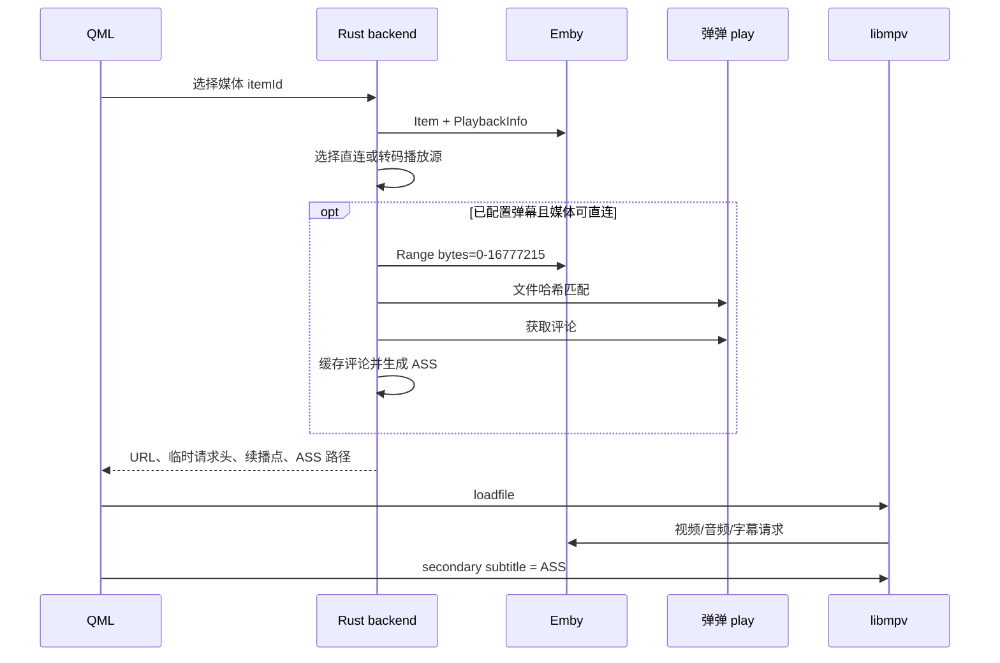

# 整体架构

## 设计原则

1. Rust 负责状态、网络、存储和安全边界；QML 只负责显示与交互。
2. libmpv 直接渲染进 Qt scene graph，避免中间帧复制。
3. 原字幕与弹幕分轨：原字幕使用主字幕轨，ASS 弹幕使用 secondary subtitle。
4. 优先原画直连；能力或带宽不满足时使用 Emby 服务端转码。
5. 网络失败不阻塞已有弹幕缓存，弹幕失败也不阻塞视频播放。

## 组件关系

## 播放流程

## Crate 边界

- `yanami-core` 不依赖具体网络或 UI，保存稳定领域类型。
- `yanami-emby` 只理解 Emby HTTP 协议和播放源；不会写磁盘。
- `yanami-danmaku` 实现签名、匹配、评论解析和确定性 ASS 排布。
- `yanami-storage` 是唯一允许持久化 SQLite 和系统凭据的模块。
- `yanami-application` 组合缓存策略、密钥读写和网络适配器。
- `yanami-desktop-bridge` 将桌面用例收敛成少量同步 C ABI；Qt 在工作线程调用它们。
- `MpvVideoItem` 是薄播放适配层，不拥有账号或持久化状态。

## 后续演进点

- 为多候选弹幕匹配加入 UI 选择，并保存用户决定。
- 将播放 Started/Progress/Stopped 事件接入 Emby，15 秒节流上报。
- 增加音轨、字幕轨和质量切换模型。
- 增加证书指纹确认流程；在完成前仅允许系统信任链的严格 TLS。
- 平台安装包、更新签名、崩溃恢复与 GPU/编解码器兼容矩阵。
