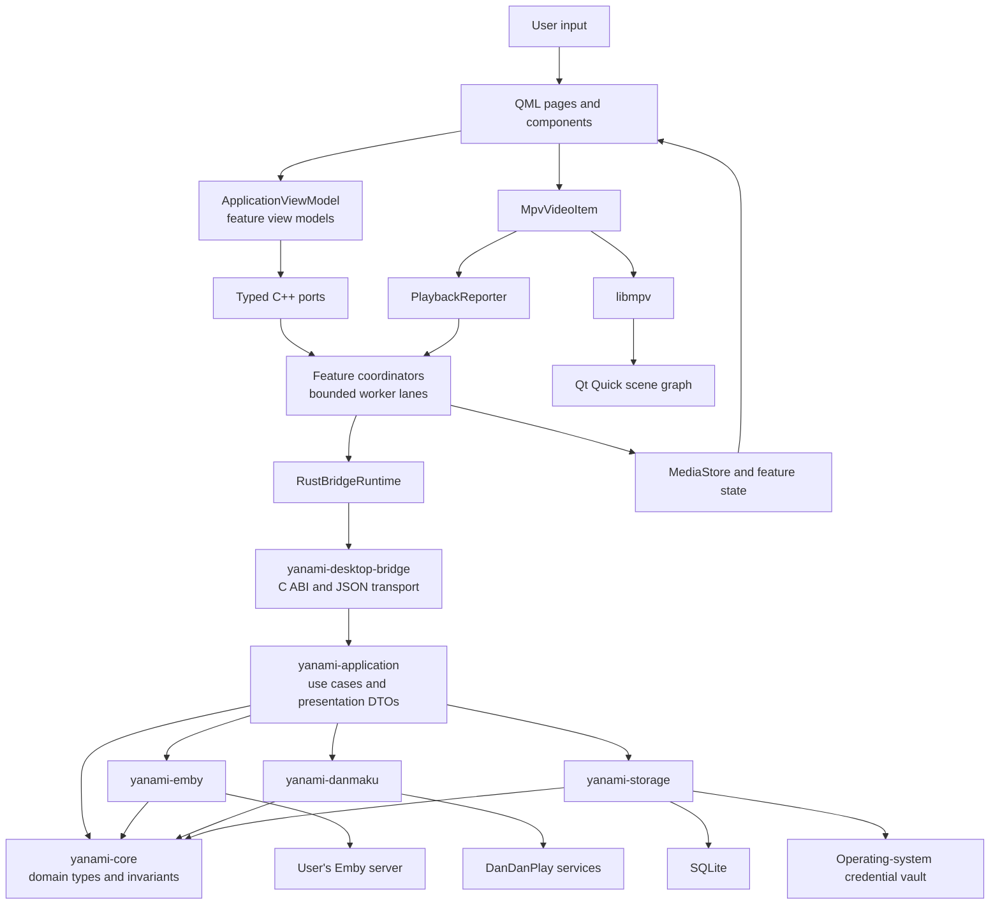
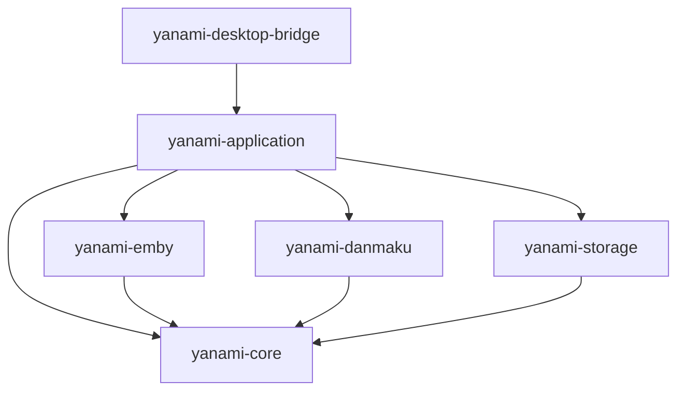
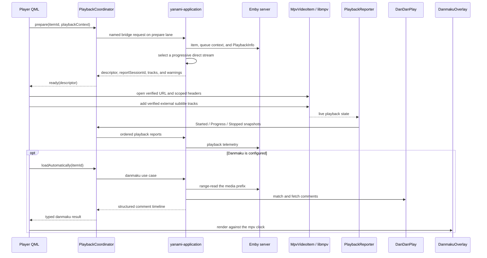

# Yanami Architecture

This document describes the current architecture of Yanami. It is organized in the same direction as a normal runtime request: process startup, QML intent, C++ coordination, the Rust boundary, application use cases, external systems, and finally the result returning to the UI.

## 1. Runtime topology

Yanami is one desktop process with three main runtime components:

- `yanami-desktop`, the Qt Quick executable containing QML and native C++ integration.
- `yanami_desktop_bridge`, a Rust `cdylib` loaded by the executable at runtime.
- `libmpv`, embedded by the C++ player and rendered through Qt's OpenGL scene graph.

Successful results return through the same layers. Catalog results are first normalized into `MediaStore`; other results resolve the state owned by the relevant feature view model. QML never consumes the C ABI or backend JSON directly.

### Ownership summary

| Layer | Owns | Does not own |
| --- | --- | --- |
| QML | Visual composition, input handling, navigation, transient control state, and the danmaku overlay | Backend JSON, request scheduling, remote workflows, durable domain data |
| Native C++ | Qt integration, feature view models, request lanes, presentation models and caches, desktop preferences, logging, update checks, and live libmpv state | Emby or DanDanPlay business rules, authenticated session persistence, domain repositories |
| `yanami-application` | Application use cases, active session and playback identities, server orchestration, image caching, danmaku policy, and presentation DTOs | Qt types, QML state, libmpv state, C ABI mechanics |
| Rust adapters | Emby and DanDanPlay protocols, SQLite repositories, and credential-vault access | UI behavior and cross-feature presentation state |
| `yanami-core` | Stable domain types and security invariants | Network, disk, runtime, or UI implementations |
| libmpv | Actual playback position, pause, volume, buffering, track selection, and seekability | Account state, Emby use cases, danmaku matching, presentation caches |

The public GitHub release check is intentionally a small desktop-shell service implemented by `UpdateChecker`; Emby and DanDanPlay traffic belongs to the Rust side.

## 2. Process startup

Startup proceeds in this order:

1. `main.cpp` selects OpenGL for Qt Quick so libmpv and the UI share the same graphics API, installs `RuntimeLogger`, and registers the native QML types.
2. `DesktopBackendServices` is created as the only desktop-backend composition root. It first creates `RuntimeHost`, `WorkerPools`, and `ApplicationStatusService`.
3. `RuntimeHost` loads the platform Rust bridge library, validates the complete ABI, creates the application data and cache directories, and opens one Rust backend handle.
4. The Rust bridge creates a Tokio runtime and opens `yanami-application`. The application opens SQLite, connects to the operating-system credential vault, restores persisted session metadata, and starts application-owned background maintenance.
5. `DesktopBackendServices` constructs the session, catalog, search, media, playback, and danmaku coordinators, then initializes them from the restored session.
6. `ApplicationViewModel` is built from the composition root's `BackendPortSet`. The asynchronous image provider is registered and the QML engine receives three context objects: `app`, `i18n`, and `windowShell`.
7. `Main.qml` is loaded. `app` is the only context object that exposes product-domain behavior.

The complete port set is constructed even when the Rust backend cannot open. This allows QML to show a deterministic startup error through `app.status` without depending on partially constructed services.

## 3. Request and result path

A normal feature request follows this sequence:

1. A QML page calls a typed method on a feature under `app`.
2. The feature view model starts an `AsyncResourceState` or `AsyncOperationState` and calls a typed C++ port.
3. The concrete feature coordinator assigns request identity, selects a concurrency lane, and runs blocking bridge work on a bounded worker pool rather than the UI thread.
4. `RustBridgeRuntime` calls one named C ABI export. JSON is used only as the transport representation for structured inputs and outputs.
5. The matching `yanami-desktop-bridge` export validates its input and invokes one `yanami-application` use case.
6. The application composes domain logic, protocol adapters, and repositories, then returns a presentation-oriented DTO.
7. The bridge serializes the DTO; C++ validates the response schema and converts it to typed Qt state.
8. The C++ coordination and presentation layers publish the result only if the applicable session, resource, lane, mutation, and view identities are still valid.
9. `MediaStore` or the feature view model emits Qt change signals, and QML updates through bindings.

This is the only supported domain request path. QML must not call the bridge, parse backend JSON, or assemble multi-request remote workflows.

## 4. Native C++ application shell

### Presentation facade

`ApplicationViewModel` is the stable QML facade. It exposes these feature models:

- `session`
- `home`
- `search`
- `favorites`
- `playback`
- `danmaku`
- `mediaActions`
- `metadataEditor`
- `imageEditor`
- `mediaTarget`
- `preferences`
- `status`
- `updates`

Each feature view model depends only on interfaces declared in `BackendPorts.hpp`. `Main.qml` owns top-level navigation, shortcuts, popup scope, and presentation routing; helper hosts such as `PlaybackHost`, `MediaActionHost`, and `ApplicationLifecycleHost` route typed results to their visual destinations. They do not implement remote use cases.

### Composition root and feature coordinators

`DesktopBackendServices` hides all concrete backend objects and exposes only `BackendPortSet`. Each feature coordinator directly implements its corresponding port.

| Component | Primary responsibility | Scheduling policy |
| --- | --- | --- |
| `SessionCoordinator` | Restored identity, login, logout, capabilities, session generation, and lifecycle fences | Serialized session-control work |
| `CatalogCoordinator` | Library, activity, favorites, collection navigation, `MediaStore`, and the session-scoped presentation cache | Coalesced resource requests and latest-wins presentation lanes |
| `SearchCoordinator` | Session-scoped local-catalog queries, bounded Top-K publication, delayed poster hydration, index progress, and stale-result rejection | One active query plus one latest queued query on a dedicated search lane; delayed hydration on a separate single-worker lane |
| `MediaCoordinator` | Metadata, images, playlists, watched/favorite state, library scans, deletion, and refresh progress | Independent latest-wins read lanes; FIFO mutations per item with bounded cross-item concurrency |
| `PlaybackCoordinator` | Playback preparation, episode switching, and ordered Emby playback reports | Latest-wins preparation lane and an ordered report lane that coalesces redundant progress |
| `DanmakuCoordinator` | Credential state, search, automatic matching, and applying a selected match | Latest-wins search and serialized ordered operations |
| `PlaybackReporter` | Converts live `MpvVideoItem` state into Started, Progress, and Stopped telemetry | Event-driven reports plus a heartbeat |
| `ApplicationStatusService` | Maps stable backend error codes to user-facing status | UI-thread state publication |

`WorkerPools` provides separate bounded resources for session control, catalog, local search, search-image hydration, media reads, media mutations, playback preparation, playback reporting, and danmaku control. Slow work in one feature therefore cannot consume the UI thread or the execution capacity reserved for another critical feature.

### Session and request identity

`SessionCoordinator` is the lifecycle authority on the C++ side. Every committed login or logout advances the session generation. Before a transition starts, `DesktopBackendServices` synchronously fences catalog, search, media, playback, reporting, and danmaku consumers. A successful transition resets session-scoped state; a failed transition reopens the previous committed session without publishing speculative identity.

Request safety is enforced at two levels:

- Coordinators use request, resource, lane, mutation, and session tokens to prevent stale work from committing to shared state.
- Feature view models use request, resource, session, and view generations to prevent a late result from reopening a closed view or replacing a newer draft.

Latest-wins is scoped to a lane, not globally. Independent features continue concurrently. Mutations for the same media item remain ordered.

### Presentation state and caches

Remote reads use `AsyncResourceState` with `Idle`, `Loading`, `Ready`, `Refreshing`, and `Error` phases. Refreshing preserves existing data as stale; a failed refresh keeps usable data visible. User commands use `AsyncOperationState` with `Idle`, `Running`, `Succeeded`, and `Failed` phases and a mutation identity.

`MediaStore` is the normalized C++ presentation store. It owns entities, query rows, `QAbstractListModel` instances, and optimistic overlays. It is not a second domain database. The small Home presentation snapshot remains optimized for stale-first screen restoration.

The full-library `MediaCatalog` is a separate, disposable Rust-side SQLite projection scoped by local server profile, Emby server, and user. It stores lightweight generic media identity, hierarchy, display metadata, image tags, and user state, but no image bytes, playback URLs, secrets, or server-owned Home-section ordering. Search indexes are versioned derivatives of that projection rather than a second source of truth. This makes the catalog reusable for future local-first library reads while allowing its search representation to be replaced or rebuilt independently.

`MediaCoordinator` can update catalog presentation state only through `CatalogMutationSink`. The sink permits optimistic patches, commit or rollback, invalidation, and reconciliation, but does not expose catalog navigation, request lanes, cache files, or the store itself.

Image DTOs contain opaque `image://yanami/<key>` URLs. Rust downloads and atomically publishes files under the application cache; `AsyncImageProvider` validates the key, waits and decodes off the UI thread, and returns a size-appropriate image. QML image components do not poll the filesystem.

### Popup policy

Application popups use the shared `AppPopup` and `AppMenu` families and register with `PopupCoordinator`. The coordinator owns stacking, scope, Escape handling, outside-click dismissal, application-shortcut blocking, and the `transient < modal < confirm < error` order. A running mutation may block dismissal, and dirty editors request confirmation before closing. Native platform dialogs such as `FileDialog` are outside this in-window popup system.

### Controller input

Controller and TV-remote input crosses one semantic boundary owned by `InputModalityController` and `ControllerNavigationSource`. Device backends and profiles own physical mappings, connection state, neutral gating, repeat, and active-device arbitration; QML owns contextual action policy and focus movement. SDL3 is the primary gamepad backend and Windows XInput is an exclusive fallback. Remote keyboard events are correlated with read-only Raw Input identity instead of being dispatched twice. See [CONTROLLER_INTERACTION.md](CONTROLLER_INTERACTION.md) for mappings, support levels, exclusions, and acceptance gates.

## 5. Rust bridge boundary

`RustBridgeRuntime` is the only C++ type that loads the Rust library, resolves symbols, owns the backend handle, or frees Rust strings. Feature code sees named C++ methods, not dynamic-library details.

The current bridge contract is:

- C ABI version 3, checked before any backend handle is created.
- Desktop JSON schema version 8 on every successful JSON response, validated by C++ before publication.
- Named exports grouped by session, catalog, local search (including the independent image-hydration status export), media, images, playback, and danmaku.
- Stable error envelopes with `code` and `message` fields.
- Panic containment at every exported Rust entry point; a panic becomes an `internal` error and never crosses the FFI boundary.
- Explicit ownership of all returned C strings through `yanami_string_free`.

The ABI is process-internal: the executable and bridge are built and shipped together. An ABI, symbol-set, or response-schema mismatch is a startup or request failure, never a signal to guess an older payload shape.

The workspace denies unsafe Rust by default. The bridge's FFI module is the narrow audited exception; application and adapter crates remain safe Rust.

## 6. Rust application and crate boundaries

Rust dependency direction is fixed:

| Crate | Responsibility |
| --- | --- |
| `yanami-core` | UI-independent domain types and invariants, including server profiles, same-origin URLs, playback plans, media tracks, and structured danmaku comments |
| `yanami-emby` | Typed Emby HTTP and WebSocket transport, protocol DTOs, catalog and media operations, playback reporting, and playback-plan selection |
| `yanami-danmaku` | DanDanPlay credentials and signing, search and matching, comment parsing, and the authenticated media-prefix hash |
| `yanami-storage` | SQLite schemas and repositories, including the disposable full-library media projection and its derived search index, plus the operating-system credential-vault abstraction |
| `yanami-application` | The only application-use-case facade; owns active Emby session state, authenticated client reuse, playback report identity, catalog/media/image/danmaku workflows, background tasks, cache policy, and presentation DTOs |
| `yanami-desktop-bridge` | Tokio runtime ownership, cancellation, JSON codec, C-string ownership, panic boundaries, and C ABI exports |

Among internal Yanami crates, `yanami-desktop-bridge` depends only on `yanami-application`. Protocol and repository details must not leak into the bridge or C++ shell.

Non-secret server and session records, danmaku choices, and comment caches live in SQLite. Emby tokens and user-provided DanDanPlay secrets live in the operating-system credential vault. Desktop-only visual preferences use `QSettings`; the Home presentation snapshot, full-library media projection, derived search index, and image files live under the application cache and may be rebuilt.

## 7. Main feature flows

### Session and catalog

On startup, Rust restores the last persisted session metadata and C++ publishes a committed session generation. `CatalogCoordinator` then restores a compatible session-scoped presentation cache for immediate display and starts a background library refresh. Authoritative results replace or patch `MediaStore` only while their session and resource tokens remain valid.

Login and logout are commit boundaries. Other coordinators stop accepting session-bound results before the Rust session changes. After commit, catalog state, playback identity, danmaku work, and feature view generations move to the new session together.

Continue Watching is a semantic Emby adapter operation, not a generic catalog query assembled by the UI or application use case. `yanami-emby` discovers the server version once per authenticated client, translates it into endpoint capabilities, and exposes one `continue_watching` method. Known servers before `4.10.0.4` use `Users/{userId}/Items/Resume`; newer or unknown servers probe `HomeSections` and then request the server-selected resume section. The stable path also reads Emby Web's user home-layout preferences so a separate Next Up row produces the same `IncludeNextUp=false` request. Its flat-user-settings versus legacy DisplayPreferences dialect is selected by version and safely probed when the version is unknown. The server owns membership, ordering, and de-duplication; Yanami never merges `IsResumable` and `NextUp` locally.

Series details use Emby's dedicated `Shows/NextUp` operation with `SeriesId` and `Limit=1` as the preferred continuation anchor, then preserve the server order and user playback state from `Shows/{SeriesId}/Episodes`. With an anchor, the scoped `seriesContinue` query contains that Episode plus every later regular Episode that is not marked played; completed holes, virtual media, Specials, and the prefix before the anchor are excluded. Without an anchor, the Episodes response distinguishes a never-started Series from a completed one: all regular unplayed Episodes are shown in server order, and the continuation row and Series hero action are hidden only when none remain. Cards play exact Episode IDs with Series queue context and present the Episode title over an `SxxExx` subtitle. Playback stop and play-state mutations invalidate the affected Series scope even while a Season or another route is displayed; an actively displayed Series is also refreshed, so the row advances without waiting for the five-minute collection TTL.

Version strings are hints rather than protocol truth. Only `404`, `405`, or `501` from the HomeSections discovery request disables that path for the current authenticated client and falls back to Resume; an error from the selected section-items request remains visible. Authentication, permission, malformed-response, transport, and server errors remain visible failures and preserve the existing presentation cache. Home-section contents and home-layout preferences are fetched on every activity refresh because the user can edit them independently of a Yanami session, while discovered endpoint capabilities are cached for that session.

Latest Media is likewise server-owned. Yanami preserves the ordered user-view list, applies `User.Configuration.LatestItemsExcludes`, and requests `Users/{userId}/Items/Latest` once per eligible view with `ParentId`, `Limit=16`, and `GroupItems=true`. When `User.Configuration.HidePlayedInLatest` is enabled it also sends `IsPlayed=false`. It deliberately omits `IncludeItemTypes`: Emby owns the view's media types and groups newly added Episodes into Series containers. A failure remains visible and preserves the prior snapshot; the client does not rebuild or reorder the row from generic Episode queries.

The desktop transport represents these rows as one ordered `latestSections` query plus scoped `latest:{viewId}` queries. `CatalogCoordinator` validates the complete set before committing it, clears scopes removed by permission or preference changes without invalidating stable QML model objects, and persists the scoped rows in the session-bound Home cache. Activity revision fences cover Continue Watching and all Latest Media scopes as one presentation snapshot.

Activity freshness remains a desktop presentation concern. Initial connection, returning to Home, reactivating the window, or a one-minute visible-Home heartbeat asks `CatalogCoordinator` to ensure activity is fresh. A 30-second admission window suppresses redundant passive requests; it is not a polling service-level guarantee. QML reports lifecycle intent but owns neither the cache decision nor Emby version rules. Passive triggers coalesce with an in-flight request, failed automatic refreshes use bounded backoff while preserving stale content, and playback stop invalidates activity before a debounced passive reconciliation plus one delayed forced consistency check.

### Full-library cache and search

Restoring or committing an Emby session starts one session-scoped catalog supervisor without opening or rebuilding the catalog on the login path. Bootstrap and rare repair traversals read Movies, Series, Seasons, and Episodes in 500-item pages; each committed page is immediately searchable and cooperative yields keep network and indexing work out of the UI and search lanes. The existing single Emby WebSocket carries refresh progress, `LibraryChanged`, and active-user `UserDataChanged` notifications. Catalog IDs are coalesced for 250 ms, persisted before acknowledgement, and fetched in bounded ID batches; removals create persistent tombstones and suppress cached Series or Season descendants without rebuilding the mmap posting-index base. Pending-change, catch-up, and membership revisions fence concurrent notifications so an older request cannot acknowledge newer work.

Every WebSocket connection or disconnect marks a possible notification gap. The supervisor repairs that gap with a timestamp delta, using a five-minute overlap around its persisted watermark, and runs the same lightweight delta every 15 minutes as a lost-event safety net. Because timestamp deltas cannot discover deletions, an exact ID-only membership pass runs after a connection gap or ambiguous folder event and every six hours, using 2000 IDs per page with images, user data, and detail fields disabled. A full detail traversal is reserved for bootstrap, a seven-day repair sweep, schema or cache replacement, or escalation after three consecutive incremental failures; the old minute-level count probe is not part of the synchronization protocol. Before a full run can delete unseen rows, its second ID-only traversal must match both the first traversal's exact member set and stable total behind a revision fence. Incomplete or failed work retains the last searchable snapshot. An empty bootstrap retries after 5 seconds and then backs off to 15 and 60 seconds for consecutive in-process failures; a failed refresh with an existing snapshot uses the normal 60-second retry. Failure is presented as an automatic retry rather than a paused service. The bounded stored reason is carried only as diagnostic status: `SearchCoordinator` logs it on transitions or detail changes, and the runtime logger redacts URLs and named credentials before persistence.

Search is local-only on the hot path and covers every committed catalog row through the persistent posting index; the bounded result window is a rendering limit, not a search-scope limit. QML submits normalized non-empty input through a 100 ms trailing policy while an empty query clears synchronously, including during IME composition. Repeated normalized input is suppressed unless a language change explicitly forces reevaluation. As soon as editing diverges from the submitted query, `SearchCoordinator` generation-fences an in-flight revision refresh, query, or image hydration so old background work cannot churn models during the debounce window. The coordinator otherwise allows one active bridge call and at most one replacement, rejects results from older request or session generations, and publishes separate title and episode models. Every committed catalog mutation advances an opaque `catalogRevision`. The current synchronous desktop ABI has no Rust-to-Qt event channel, so a visible, non-empty, idle Search page performs a search-only 750 ms empty-query status check; an unchanged revision emits no model or hydration work, while a changed revision reuses the latest-wins query lane. The active query is therefore rerun after each observed page or incremental commit, and newly indexed matches appear progressively instead of waiting for the full catalog to finish. Lifecycle-only status changes update progress or error copy without republishing rows. `MediaStore` applies stable-ID inserts, moves, removals, and patches without a model reset; `SearchResultRowsModel` projects both semantic sections into header and card rows consumed by one pooled vertical `ListView`, so only visible cards exist, and entity-only patches invalidate just the affected visual rows. List, row, and card-root geometry or opacity transitions are forbidden because pooled delegates can retain transient state. A newly submitted query resets position deterministically; background revisions instead preserve the top visible item and pixel offset. Semantic focus is restored by item ID only while the visible Search page remains in keyboard/controller navigation mode, so pointer scrolling and hidden pages are never pulled back to a stale card. Returning to Search or reactivating the window also checks once immediately.

Rust selects up to 50 Series/Movie hits and 50 Episode hits before merging them in title-first order, so a large episode set cannot crowd Series out of the result window. Episode cards keep their real Episode ID and Series playback context while presenting the parent Series title, `SxxExx · episode title`, and the parent Series poster when available. The response carries an explicit `imageItemId`, `imageItemType`, and tag so URL planning and delayed hydration address the same image owner; an Episode image is only the fallback when the parent Series has no poster. The first Rust phase derives stable `image://yanami` cache URLs but performs no filesystem access, dedupe reservation, or download scheduling. After the published query remains unchanged for 150 ms, C++ passes the bounded published image descriptors to `yanami_backend_catalog_search_hydrate_images` on a separate single-worker lane. The hydration use case does not query SQLite or call Emby synchronously; it rechecks the current session, validates the descriptor set, then schedules only missing cache entries through the existing image-download dedupe set and bounded semaphore. A newer query or session transition cancels pending hydration and generation-fences any stale completion; image hydration never republishes or patches the search result model. Rust reports cached-row and synchronization status so the page can state honestly when results cover only the currently indexed portion of the library. Unicode compatibility normalization, full case folding, aliases, pinyin forms, and season or episode codes are search-index concerns; navigation and playback continue to use real Emby entity and hierarchy identifiers.

### Media reads and mutations

Editor and target-selection reads use independent latest-wins lanes so one slow query does not block unrelated interaction. When a mutation has an optimistic presentation effect, `MediaCoordinator` records a journal through `CatalogMutationSink`, invokes the Rust use case, then commits the authoritative result or rolls back the matching journal. Metadata refresh and library scans complete as server operations and are reconciled through refresh progress, invalidation events, and bounded fallback checks.

### Playback and danmaku

`yanami-application` resolves playable items, builds queue context, requests Emby playback information, selects a safe source, and creates a unique report session. It owns server-side playback identity but not a copy of live player state.

`MpvVideoItem` is the only libmpv runtime owner. It loads the prepared URL, applies request headers, adds external subtitles, observes playback properties, and renders libmpv into a Qt Quick framebuffer without CPU frame copies. Original subtitles remain libmpv tracks.

`PlaybackReporter` samples the actual player state after the file is loaded. It reports state changes and a heartbeat, maps mpv tracks back to Emby stream indexes when the mapping is unambiguous, and queues one terminal Stopped event for an active report session. Reporting failures do not block closing the player or switching items.

Danmaku is a separate optional path. Automatic matching hashes at most the first 16 MiB of the verified same-origin media stream, reuses persisted match choices and comment caches, and returns an immutable structured timeline. `DanmakuOverlay` lays out and renders that timeline against the same mpv clock. Danmaku failure never stops video playback, and toggling the overlay never changes libmpv subtitle or demux state.

The active playback planner supports progressive direct streams only. It does not select Emby transcoding or adaptive HLS/DASH sources.

## 8. Security, failure, and shutdown boundaries

- Server profiles require HTTPS by default; insecure HTTP is an explicit per-profile choice.
- Playback and subtitle URLs are checked against the configured Emby origin. Cross-origin URLs and redirects cannot receive account credentials.
- Secrets are kept out of SQLite and presentation caches. The runtime logger redacts URLs, tokens, authorization fields, and bearer values before writing rotating persistent logs.
- Backend errors retain stable machine codes for policy and localized presentation; diagnostic text is logged rather than used as a control protocol.
- Cached catalog data, image files, danmaku comments, and video playback are separate failure domains. Loss of one optional cache or service does not invalidate the others.

Shutdown is owned by `DesktopBackendServices` and proceeds in this order:

1. Stop accepting new feature requests and fence the current session.
2. Stop playback reporting and feature-owned timers or queues.
3. Broadcast cancellation to the Rust application and its background tasks.
4. Drain coordinator watchers and native worker pools while the bridge handle remains alive.
5. Free the Rust backend, stop Tokio, unload the bridge library, and finally close the runtime log.

## 9. Rules for extending the architecture

1. Expose a new user-facing workflow through a focused feature view model and a typed port. Do not add raw backend access or JSON parsing to QML.
2. Put Qt and operating-system integration in C++; put Emby or DanDanPlay policy, domain persistence, and cross-protocol use cases in Rust.
3. Add a named `RustBridgeRuntime` method, a named C ABI export, and one `yanami-application` use case for new backend behavior. Keep protocol DTOs inside their adapter crate.
4. Define the request lane, resource key, session identity, view identity, cancellation behavior, and stale-result policy before dispatching asynchronous work.
5. Use `AsyncResourceState` for remote reads and `AsyncOperationState` for user commands. Preserve usable stale data when refresh fails.
6. Route catalog presentation changes through `CatalogMutationSink`; do not reach into `MediaStore` from unrelated coordinators.
7. Use the shared popup families and `PopupCoordinator` for every in-window popup.
8. Keep live playback state in `MpvVideoItem`, playback reporting in `PlaybackReporter`, server playback identity in `yanami-application`, and danmaku rendering in `DanmakuOverlay`.
9. Update ABI and schema constants on both sides together, and add architecture or timing tests for any new boundary or concurrency policy.

## 10. Source map

Paths are repository-relative. Bare C++ filenames below are under `apps/desktop/native/`.

| Area | Primary sources |
| --- | --- |
| Build and bootstrap | `apps/desktop/CMakeLists.txt`, `apps/desktop/native/main.cpp` |
| Composition and public C++ boundaries | `DesktopBackendServices.*`, `BackendPorts.hpp`, `BackendInfrastructure.*` |
| Presentation facade and state | `ApplicationViewModel.*`, `AsyncResourceState.*`, `AsyncOperationState.*`, `MediaStore.*` |
| Request scheduling | `*Coordinator.*`, `RequestCoordinator.hpp`, `KeyedMutationScheduler.hpp` |
| QML composition | `apps/desktop/qml/Main.qml`, `pages/`, `components/` |
| Playback integration | `MpvVideoItem.*`, `PlaybackReporter.*`, `PlaybackReportQueue.*`, `PlaybackTrackMapper.*` |
| Dynamic bridge | `RustBridgeRuntime.*`, `crates/yanami-desktop-bridge/src/` |
| Rust use cases | `crates/yanami-application/src/` |
| Domain and adapters | `crates/yanami-core/`, `crates/yanami-emby/`, `crates/yanami-danmaku/`, `crates/yanami-storage/` |
| Enforced architecture checks | `apps/desktop/tests/BackendArchitectureTests.cpp`, `apps/desktop/tests/QmlArchitectureTests.cpp` |
